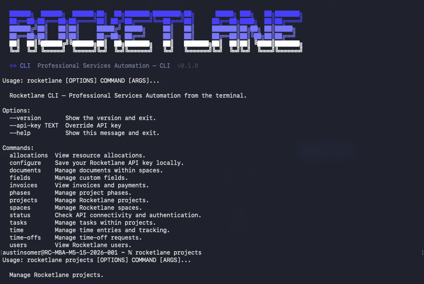

# Rocketlane CLI

A command-line tool for [Rocketlane](https://rocketlane.com) — Professional Services Automation from the terminal.

Built for the Solution Engineering team to manage projects, tasks, time tracking, and more — directly from the terminal or through Claude Code.



## Install

### Homebrew (recommended)

```bash
brew tap trouze/tap
brew install rocketlane-cli
```

### pip

```bash
pip install rocketlane-cli
```

### From source

```bash
git clone https://github.com/trouze/rocketlane-cli.git
cd rocketlane-cli
pip install -e .
```

### 2. Connect Your Instance

Run any command and the first-run setup will prompt you:

```bash
rocketlane status
```

You'll be asked for:
- **Instance URL** — e.g. `acme.rocketlane.com` (auto-generates short name `acme`)
- **API Key** — from Rocketlane: **Settings > API > Create API key**

The key is validated and saved to `~/.rocketlane/config.json` (permissions `600`).

### 3. Start Using It

```bash
rocketlane projects list
rocketlane tasks list --project-id 5000000023535
rocketlane time create --task-id 501 --hours 2.5 --date 2026-03-24
```

## Multi-Instance Support

Work across multiple Rocketlane accounts without re-authenticating.

```bash
# Add another instance
rocketlane add-instance
# Prompts for URL + API key, validates, saves, sets as active

# List all instances (● = active)
rocketlane instances

# Switch active instance (interactive menu)
rocketlane switch

# Use a specific instance for one command
rocketlane -i acme projects list

# Remove an instance
rocketlane remove-instance old-instance --yes
```

## Resources

| Command | Description |
|---------|-------------|
| `projects` | Project CRUD, members, templates, placeholders |
| `tasks` | Task CRUD, assignees, followers, dependencies |
| `phases` | Project phase management |
| `fields` | Custom field management |
| `users` | View users |
| `spaces` | Workspace management |
| `documents` | Space document management |
| `time` | Time entry tracking |
| `time-offs` | Time-off management |
| `allocations` | Resource allocation views |
| `invoices` | Invoice, payment, and line item views |

## Examples

```bash
# List active projects
rocketlane projects list --status "In progress"

# Create a new project
rocketlane projects create --name "Acme Onboarding" --customer "Acme Inc" --owner "you@company.com"

# Add a task
rocketlane tasks create --project-id 201 --name "Kickoff Call" --due-date 2026-04-01

# Log time
rocketlane time create --task-id 501 --hours 2.5 --date 2026-03-24

# Get JSON output for scripting
rocketlane projects list --json | jq '.[] | .projectName'
```

## Help

```bash
rocketlane --help                  # Top-level help
rocketlane projects --help         # Resource-level help
rocketlane projects create --help  # Command-level help
```

## Using with Claude Code

See **[CLAUDE_CODE_SETUP.md](CLAUDE_CODE_SETUP.md)** for full instructions on setting up the Rocketlane CLI as a Claude Code skill so you can interact with Rocketlane via natural language.

Quick preview — once set up, just ask:

> "List my Rocketlane projects"
> "Switch to the acme instance and show tasks"
> "Create a project for Acme Corp with a kickoff task due next Monday"
> "Log 2 hours against task 501"

## Dependencies

- Python 3.9+
- [click](https://click.palletsprojects.com/) — CLI framework
- [httpx](https://www.python-httpx.org/) — HTTP client
- [rich](https://rich.readthedocs.io/) — Terminal formatting
- [python-dotenv](https://pypi.org/project/python-dotenv/) — Env file support

## License

MIT
